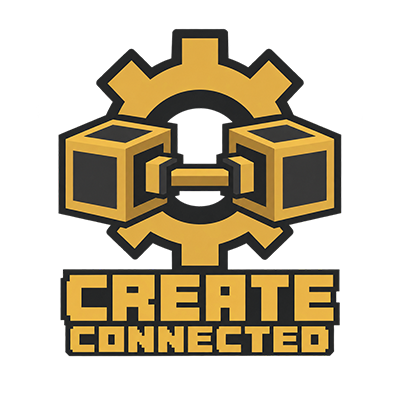

# Create: Connected (Adapted)

Unofficial NeoForge adaptation of [Create: Connected by Lysine](https://github.com/hlysine/create_connected) for Minecraft **26.1.2, 26.2 and 26.3**. This fork uses a distinct name and custom icon. It is not an official release from the original author.

[Download the latest JARs](https://github.com/AlexSensey/create-connected-adapted/releases/latest)

| Minecraft | JAR | Source branch |
| --- | --- | --- |
| 26.1.2 | [Connected 0.6](https://github.com/AlexSensey/create-connected-adapted/releases/download/adapted-0.6/create_connected-1.3.3-adapted-26.1.2-0.6.jar) | [adapted/26.1.2](https://github.com/AlexSensey/create-connected-adapted/tree/adapted/26.1.2) |
| 26.2 | [Connected 0.6](https://github.com/AlexSensey/create-connected-adapted/releases/download/adapted-0.6/create_connected-1.3.3-adapted-26.2-0.6.jar) | [adapted/26.2](https://github.com/AlexSensey/create-connected-adapted/tree/adapted/26.2) |
| 26.3 | [Connected 0.6](https://github.com/AlexSensey/create-connected-adapted/releases/download/adapted-0.6/create_connected-1.3.3-adapted-26.3-0.6.jar) | [adapted/26.3](https://github.com/AlexSensey/create-connected-adapted/tree/adapted/26.3) |

Use the JAR matching your Minecraft version with NeoForge and [Create: Adapted](https://github.com/AlexSensey/create-adapted). Replace the previous Connected JAR in your `mods` folder; install one Connected JAR per instance.

This branch targets Minecraft **26.1.2**, NeoForge **26.1.2.109** or newer within that Minecraft version, and Create **[6.0.11-adapted-1.27,)**. REI and JEI integrations are optional. Extra fan processing types require their respective optional mods.

## Changes in 0.6

- The Kinetic Battery discharge-direction hint appears only when hovering its settings area.
- The Kinetic Battery tutorial's dynamically created conveyor belt renders correctly.
- Includes Kinetic Bridge frame alignment, custom icon, REI integration and conditional fan catalyst resources.

See [fixed.md](fixed.md) for version-specific fixes and [verification.json](verification.json) for validation. Native tests passed 72 battery hover assertions on each supported Minecraft version. The battery tutorial belt and charging/redstone mode switching were tested in 26.3.

## Building

Use Java 25 and the included Gradle wrapper. Builds use pinned adapted dependency JARs listed in [tools/build-dependencies.json](tools/build-dependencies.json); stage these files and their manifest under `build/dependencies-26.1.2` before running `gradlew jar`. The preparation tools in `tools/` document the required APIs. Dependency JARs are not bundled with the source archive. The retained optional Simulated integration requires the real matching Simulated API.

## Credits and license

Original mod, code and assets: **Lysine and Create: Connected contributors**. Minecraft 26.x adaptation and maintenance: **AlexSensey**.

[Original repository](https://github.com/hlysine/create_connected) ? [Original CurseForge page](https://www.curseforge.com/minecraft/mc-mods/create-connected)

Licensed under [GNU AGPL v3 with the original additional terms](LICENSE). Corresponding source is available in this repository and the version-specific source archives attached to each release.
